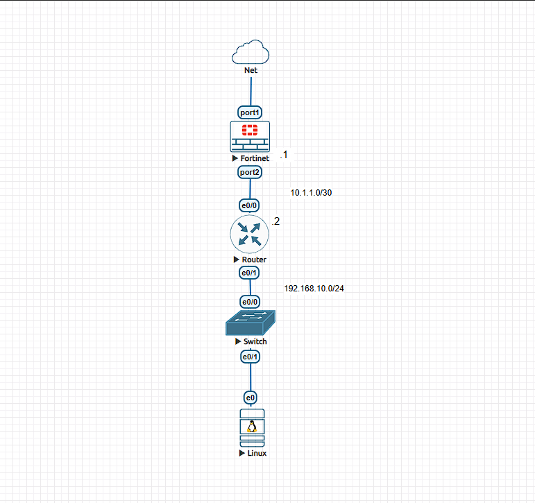
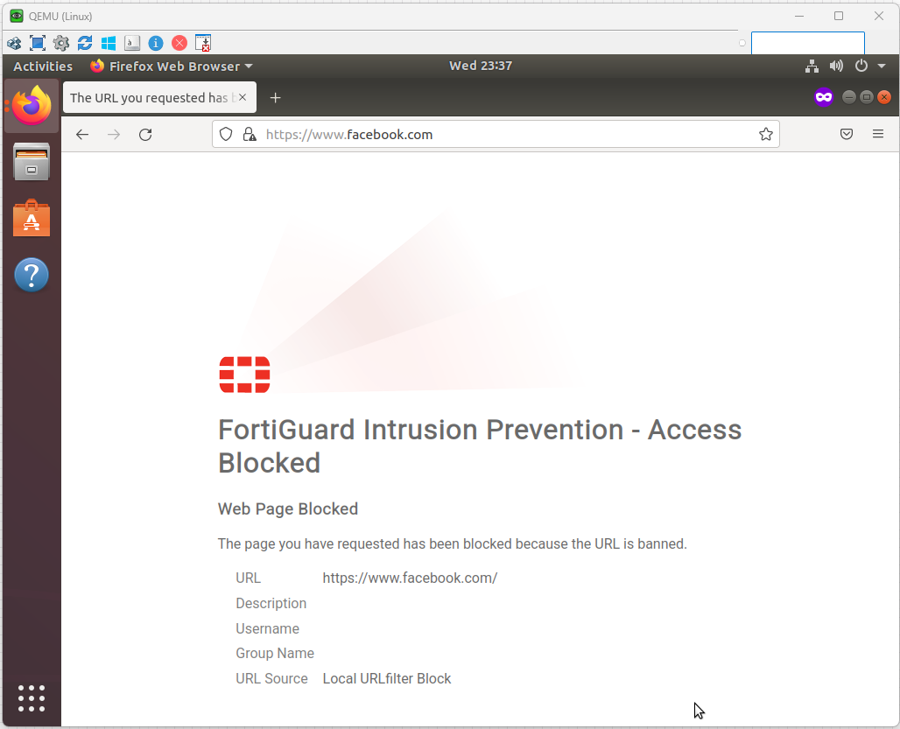
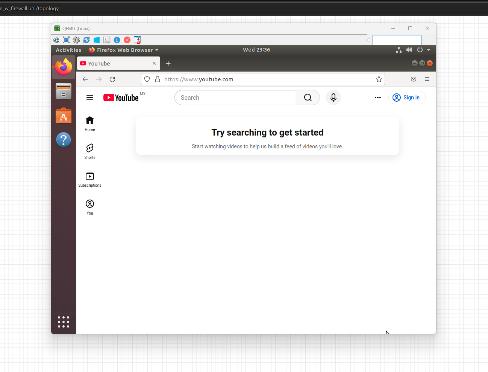
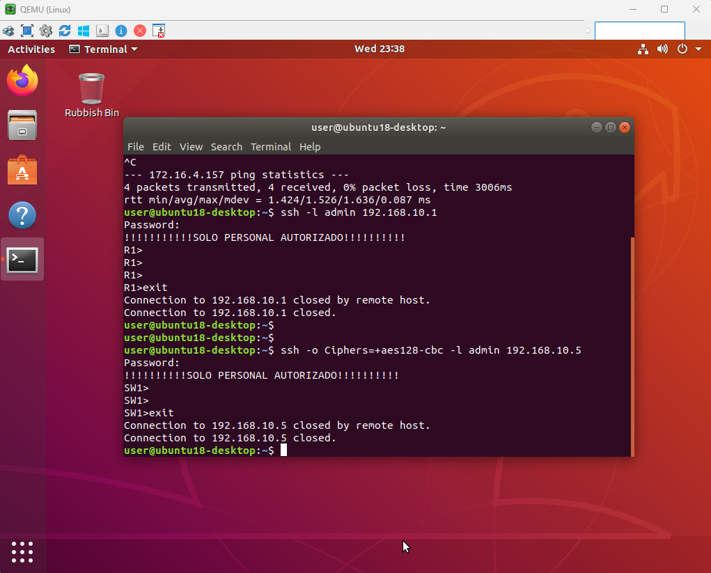

# Laboratorio 01 - LAN Básica con Firewall

## Objetivo

Implementar una red LAN básica utilizando Fortinet, Router Cisco y Switch, permitiendo la salida a Internet mediante NAT.

## Topología

Internet → Fortinet → Router → Switch → Ubuntu

## Direccionamiento

| Dispositivo | Interfaz | IP |
|------------|-----------|-----|
| Fortinet | port1 | DHCP |
| Fortinet | port2 | 10.1.1.1/30 |
| Router | e0/0 | 10.1.1.2/30 |
| Router | e0/1 | 192.168.10.1/24 |
| Ubuntu | eth0 | 192.168.10.10/24 |

## Configuración realizada

- Configuración de interfaces.
- Ruta por defecto.
- Política de firewall.
- NAT saliente.
- Pruebas de conectividad.

## Resultados

- Conectividad entre dispositivos.
- Acceso a Internet desde Ubuntu.
- Resolución DNS funcional.

## Evidencias

## Política de Firewall en FortiGate

---

## Conectividad a Internet

---

## Acceso SSH al Router

## Aprendizajes

- Configuración básica de FortiGate.
- Implementación de NAT.
- Configuración de rutas estáticas.
- Verificación de conectividad.
