# LAN Two-Tier Network Lab

## Description

Este laboratorio consiste en una red empresarial de dos niveles (**Two-Tier Architecture**) implementada en EVE-NG. El diseño incorpora redundancia, segmentación de red y servicios de infraestructura para proporcionar alta disponibilidad, administración centralizada y conectividad segura entre dispositivos.

La topología emplea una combinación de enlaces punto a punto, estrella y una arquitectura parcialmente mallada (*Partial Mesh*) entre los dispositivos principales de la red.

---

## IP Addressing

| VLAN | Name | Network | Gateway Virtual (HSRP) |
|------|--------|---------|---------|
| 10 | Users | 192.168.10.0/24 | 192.168.10.1 |
| 20 | Guest | 192.168.20.0/24 | 192.168.20.1 |
| 30 | Servers | 192.168.30.0/24 | 192.168.30.1 |
| 99 | Management | 192.168.99.0/24 | 192.168.99.1 |

---

## Technologies

- VLANs
- Inter-VLAN Routing mediante SVIs
- HSRP (Hot Standby Router Protocol)
- DHCP Server (Alpine Linux)
- DHCP Relay (IP Helper Address)
- SSH
- ACLs (Access Control Lists)
- FortiGate Firewall
- NAT (Network Address Translation)
- OSPF
- LACP (EtherChannel)
- STP (Spanning Tree Protocol)
- IEEE 802.1Q
- LLDP
- CDP

---

## Topology

```text
Internet
    |
FortiGate Firewall
    |
Router R1
    |
+-------------------+
|                   |
SW-DST1 -------- SW-DST2
 |                  |
 |                  |
SW-ACC1         SW-ACC2
 |                  |
Hosts          Hosts

        |
Alpine DHCP Server
```

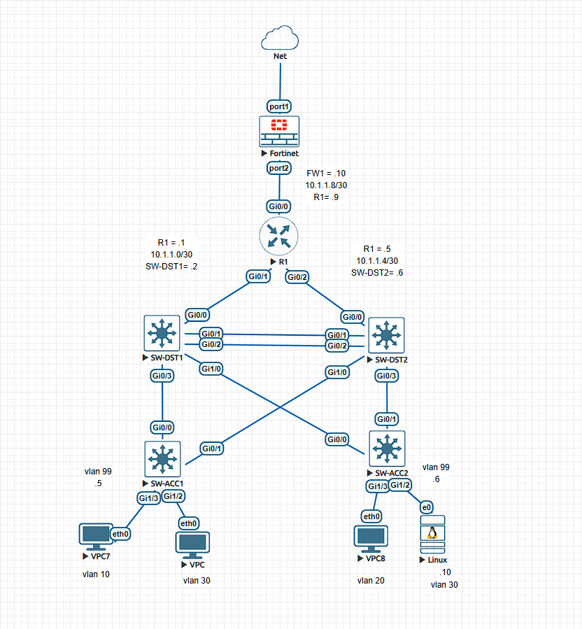

---

## Configuration

### Network Design

Se realizó el diseño lógico de la red, definiendo VLANs para usuarios, invitados, servidores y administración.

Asimismo, se implementó un esquema de direccionamiento IP basado en subnetting para optimizar el uso de direcciones en los enlaces punto a punto y en las redes LAN.

### Firewall (FortiGate)

- Configuración inicial del dispositivo.
- Asignación de contraseña administrativa.
- Obtención de dirección IP mediante DHCP en la interfaz WAN.
- Configuración de dirección IP estática en la interfaz interna.
- Habilitación de servicios de administración remota:
  - HTTP
  - HTTPS
  - SSH
  - Ping
- Configuración de NAT para proporcionar acceso a Internet a toda la red.
- Configuración de ruta por defecto.
- Participación en OSPF para la distribución dinámica de rutas.

### Router R1

- Configuración básica:
  - Hostname
  - Banner MOTD
  - Logging synchronous
  - Interfaces
- Implementación de OSPF área 0.
- Configuración de SSH:
  - Nombre de dominio
  - Usuarios locales
  - Claves RSA
  - Líneas VTY
  - Login local
  - Transport input SSH

### Distribution Switches

#### General Configuration

- Configuración básica.
- Creación de VLANs.
- Configuración de enlaces troncales IEEE 802.1Q.
- Restricción de VLANs permitidas en los troncales.
- Desactivación de DTP mediante `switchport nonegotiate`.
- Configuración de SVIs para el enrutamiento inter-VLAN.
- Configuración de OSPF.
- Configuración de SSH.
- Configuración de DHCP Relay (`ip helper-address`).

#### HSRP

Se implementó HSRP para proporcionar redundancia de gateway:

- SW-DST1 activo para VLAN 10, VLAN 30 y VLAN 99.
- SW-DST2 activo para VLAN 20.

#### EtherChannel

- Implementación de EtherChannel mediante LACP.
- Canal configurado como troncal para redundancia y balanceo de carga.

#### STP

Se configuró Spanning Tree Protocol para aprovechar los enlaces redundantes:

- SW-DST1 como Root Primary para VLAN 10 y VLAN 30.
- SW-DST2 como Root Primary para VLAN 20.

#### ACLs

##### Guest VLAN ACL

Se implementó una ACL extendida para impedir que los usuarios de la VLAN Guest accedieran a:

- VLAN 10 (Users)
- VLAN 30 (Servers)
- VLAN 99 (Management)

La VLAN Guest únicamente tiene acceso a Internet.

### Access Switches

- Configuración básica.
- Creación de VLANs.
- Configuración de enlaces troncales.
- Configuración de SSH.

### DHCP Server (Alpine Linux)

- Configuración de dirección IP estática.
- Instalación de ISC DHCP Server.
- Configuración de pools DHCP para:
  - VLAN 10
  - VLAN 20
- Configuración de gateway predeterminado.
- Configuración de DNS.
- Habilitación del servicio DHCP para inicio automático.
- Verificación de entrega de direcciones mediante DHCP Relay.

### Subnetting

Se realizó subnetting utilizando la red `10.1.1.0/24` para los enlaces punto a punto.

Se emplearon subredes `/30` para optimizar el uso de direcciones IPv4, permitiendo únicamente dos hosts por enlace.

---

## Tests

### Connectivity

- Inter-VLAN routing verificado.
- Conectividad completa hacia Internet.
- Comunicación entre dispositivos de infraestructura.

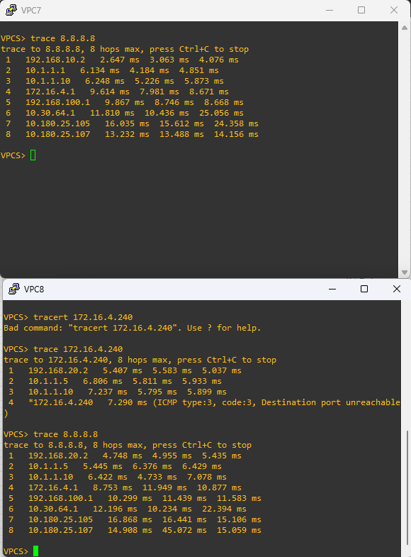

### DHCP

- Asignación correcta de direcciones IP en VLAN 10.
- Asignación correcta de direcciones IP en VLAN 20.
- Funcionamiento correcto del DHCP Relay.

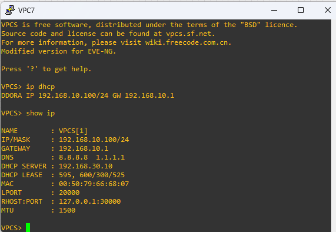

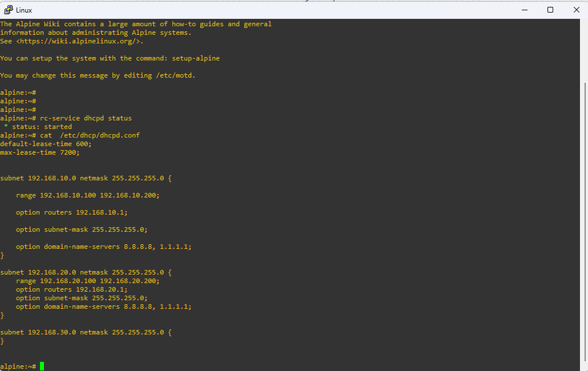


### HSRP

- Verificación del gateway virtual.
- Pruebas de failover exitosas.

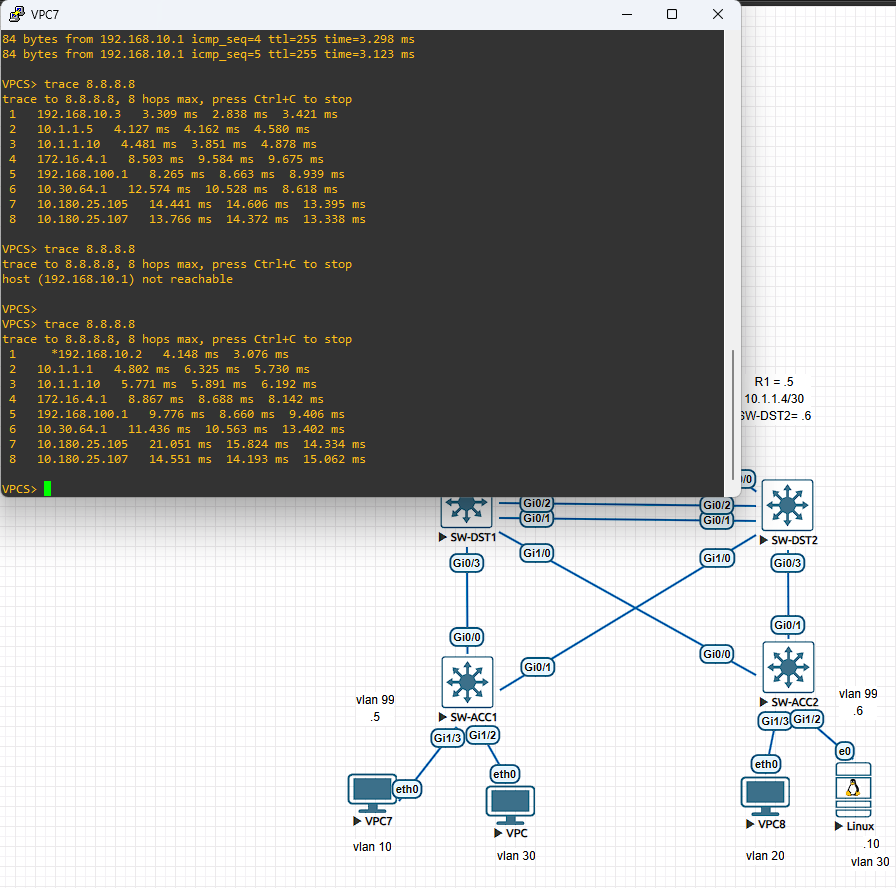

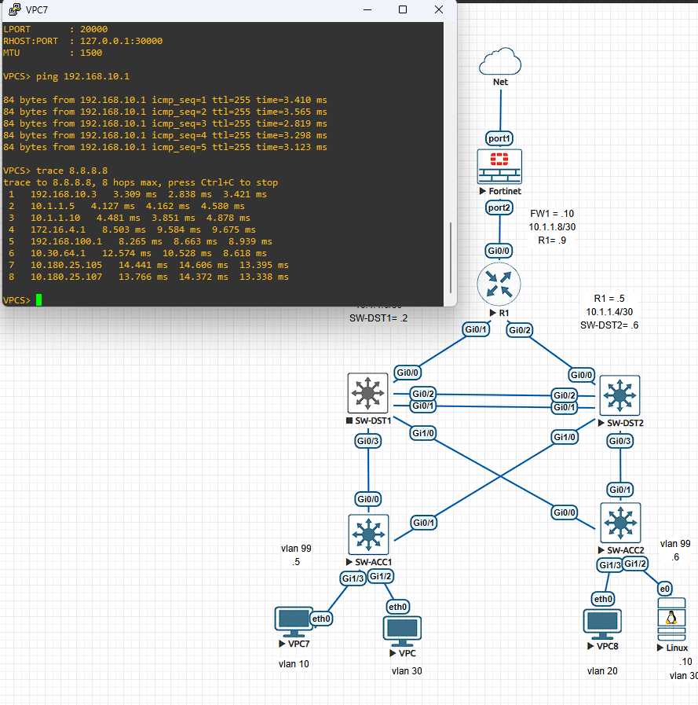


### OSPF

- Formación correcta de vecinos.
- Intercambio correcto de rutas.

### Security


- ACL Guest funcionando correctamente.

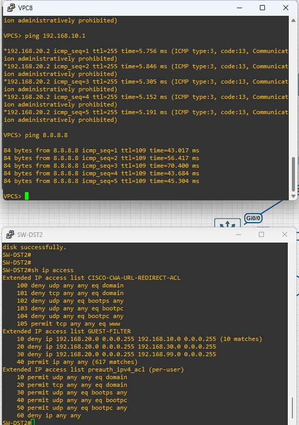


### SSH

- Conexión SSH a R1 desde SWDST1

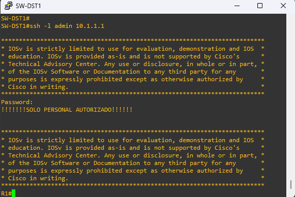


### EtherChannel

- Verificación mediante:

```bash
show etherchannel summary
```

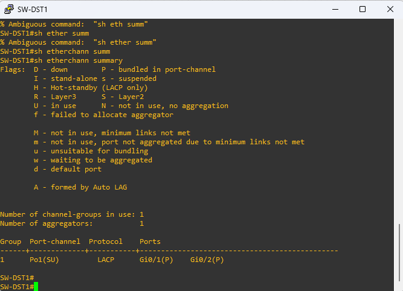


### HSRP

Verificación mediante:

```bash
show standby brief
```

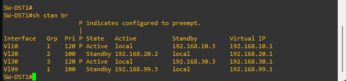

### OSPF

Verificación mediante:

```bash
show ip ospf database
```
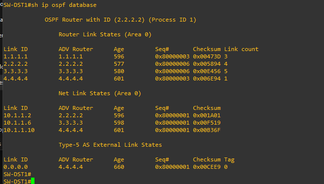

```bash
show ip route
```

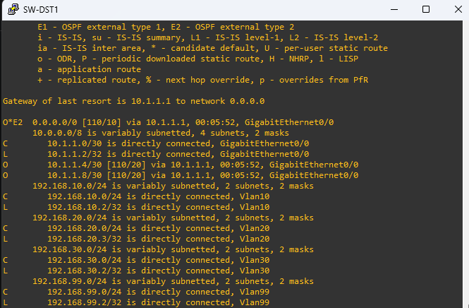


---

## Conclusions

La red quedó completamente operativa e integra múltiples tecnologías utilizadas en entornos empresariales reales.

Durante el desarrollo del laboratorio se reforzaron conceptos relacionados con:

- Segmentación de red.
- Alta disponibilidad.
- Redundancia.
- Enrutamiento dinámico.
- Seguridad.
- Administración remota.

Se concluyó que el diseño de una red empresarial requiere una adecuada planificación del direccionamiento IP, la definición de políticas de seguridad, la selección de protocolos adecuados y una arquitectura bien estructurada antes de iniciar la implementación.

---

## Future Improvements

- Implementación de Zabbix para monitoreo.
- Implementación de Syslog centralizado.
- Integración de NTP.
- Implementación de Port Security.
- Integración de servidores DNS internos.